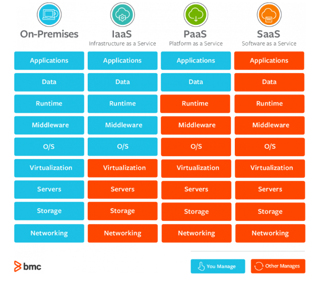
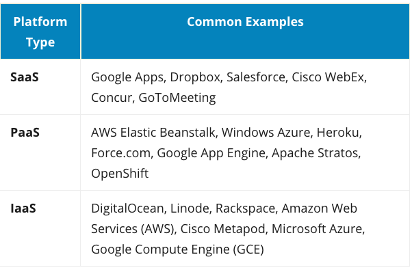

# Common Languages And Descriptions

Statically-typed: Type of variable must be knowned at compile-time. (Must declare a variable with a type)
Dynamically-typed: Type of variable is only known at runtime

Strongly-typed: Does not allow implicit data conversion (no silent changes)
Weakly-typed: Allows implicit data conversion (undetected)

### JavaScript
Weakly-typed, Dynamically-typed

Used for: 
Frontend - as we have seen
Backend - Run via Node.js, servers such as express.js

Linked Technologies
- Express.js -> a backend web framework that runs on JS (instead of Rails)
- React -> we know about that
- React Native -> iOS and Android development
- Angular -> JS Framework, competitor to React. Does the same thing, made by Google instead of Facebook
- jQuery -> JS Library used on the frontend to manipulate the DOM. 
- Backbone.js -> JS MVC framework. Makes "models" that, when changed, will update the DOM, kind of like ActiveRecord with RoR
- Polymer -> JS library made by Google which lets you make custom HTML elements (like in React)

### PHP
Weakly typed, Dynamically typed

https://www.freecodecamp.org/news/the-best-php-examples/

Server side scripting language
Old, mostly legacy code, but still lots of demand
Many sites use PHP

### Ruby
Strongly Typed, Dynamically Typed

Functional and OOP

Scripting language used for backend

Technologies
-> Ruby on Rails
-> Redis - Local data store / cache in RoR
-> Sidekiq - Background tasks run on RoR 

### Python

Used for: Backend, Data Science
Functional and OOP

Linked Technologies
- Django - Web dev framework like rails
- Flask - Lightweight web dev framework (more like Sinatra)
- Jupyter Notebooks (Data Science)
- Pandas, Numpy, Matplotlib (Data Science)

### C++
Weakly Typed, Statically Typed

OOP

Used for: Video game dev, military / firmware applications
- Manual Memory Management
- Very fast
- Unreal Game Engine

### C
Weakly Typed, Statically Typed

Functional

Used for: 
- Kernel Development
- Firmware 
- Hardware / microcontrollers

### C# (.NET)
Strongly typed, Statically Typed

For Windows Development
Similar to Java

Using .NET, can use C# for: 
- Web development
- Windows Native Apps
- Game Development (Unity)

### Java
Strongly Typed, Statically Typed

OOP

"Enterprise" 

Linked Technologies
- Java Virtual Machine (compile once, run anywhere)
- Android Development
- Web development, native apps

### Swift
Strongly Typed, Statically Typed

OOP

OSX / iOS native app development only

### Objective-C
Dynamic and Strongly typed, Strong and Weak Typed

Being replaced by swift

OOP

OSX / iOS native app development only

### GoLang
Strongly Typed, Statically Typed

Syntactically similar to C, but with memory safety, garbage collection, structural typing

Functional

Used for: 
Programming across large-scale network servers and big distributed systems. Golang emerged as an alternative to C++ and Java for the app developers in the context of what Google needed for its network servers and distributed systems

### Scala

- OO and Functional. More declaritive than Java and less restrictive
- Runs on the Java Virtual Machine (JVM)
- General purpose programming language
- Frameworks allow web dev and native apps built inside of the JVM with Scala

### HTML

HTML5

- canvas for web games

### CSS

Linked Technologies

- Flexbox - built in
- CSS Grid - built in

Frameworks:
- Materialize
- Bootstrap
- SemanticUI
- Foundation
- Bulma
- Tailwind CSS

### JSON / XML

Formatted text for sending information in HTTP requests

# Databases

### SQL
- No arrays
- Need join tables

Relational databases:
- MySQL
- PostgreSQL
- SQLite3
- Microsoft SQL Server
- Oracle 
- MariaDB

### NOSQL

- Data Storage in the form of JSON. 
- Allows arrays

Popular NoSQL Databases:
- MongoDB
- Redis

# MISC

### MEAN / MERN / LAMP / Generic Stack
MEAN
- MongoDB
- Express.js
- Angular JS
- Node.js

MERN
- MongoDB
- Express.js
- React
- Node.js

LAMP
- Linux OS
- Apache Web Server
- MySQL DB
- PHP 

Stack: 
- Operating System (Linux, Unix, Windows) even on the cloud
- Web Server (Apache, NGINX)
- Database (SQL, NoSQL)
- Backend / scripting (RoR, Django, Express.js, etc)
- Frontend (JS, Angular, React, etc)

### GraphQL
Made by Facebook
API query langauge that is an alternative to REST

Complex apps had to hit multiple API endpoints which utilized RESTful conventions
GraphQL can take one complex query and distribute it to multiple other endpoints (databases, other API endpoints), and get the response, thereby making only one "smart" forward-facing API for a client

https://www.freecodecamp.org/news/so-whats-this-graphql-thing-i-keep-hearing-about-baf4d36c20cf/

### Webpack

Bundles JS code
You don't have to link every file in a script tag
`import` and `export` in react 

### WordPress

A tool for making websites (multiple types of websites).

Graphical UI

A WordPress developer makes custom plugins and modules. 
WordPress uses PHP

### SEO
Search Engine Optimization

Utilizing characteristics of search engines to make your website more "visible"

### MVC

- Model
- View 
- Controller

### NPM / YARN

- JS Package managers
- Similar to bundle

### TDD (test Driven Development)

- Mocha - JS test framework
- Rspec - ruby test framework
- Jest - JS test framework

### Circle-CI

Continuous Integration

Tests your app whenever you make changes

A YAML file tells it what to run when it detects a change on a git branch

Automates deployments and releases

### AWS / Cloud
- EC2 -> a little computer you can spin up
- S3 Bucket -> data storage
- Elastic Beanstalk -> Multiple EC2 + autoscaling

- Cloud = pay-as-you-go and pay-as-you-need-it computing resources
- SAAS -> Software as a service
- PAAS -> Platform as a service
- IAAS -> Infrastructure as a service

### Web Sockets

Real-time communication from Server to Frontend (server can PUSH info to frontend instead of frontend requesting it periodically [called polling])

Other notable languages:
- R
- Perl
- Rust
- Groovy
- MATLAB
- Visual Basic
- Assembly Language
- Kotlin
- Dart
- Ada
- Cobol
- Haskell